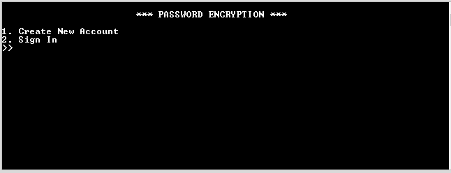

<h1>Password Encryption</h1>
<h2>About</h2>

A simple encryption program that allows users to store website login information to a file. A convenient way of safely storing private information from wandering eyes instead of handwriting or storing to a file in plaintext. 

<h5>Opening Menu</h5>

Create New Account creates a new record in the account.txt file which will store username and password entered. A separate file will be created specifically for that user to hold their login information. Error message will display if that record already exist to prevent ambiguity. 

Sign In allows user to enter their username and password, checks account.txt for a match. If no match is present, message will display username or password incorrect and will give the user another chance. Up to 3 failed tries allowed before program closes.

<h5>Login Information Menu</h5>
